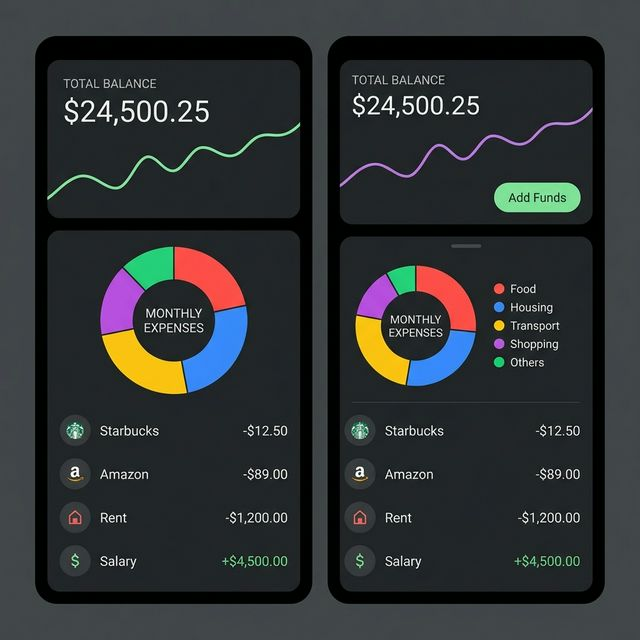
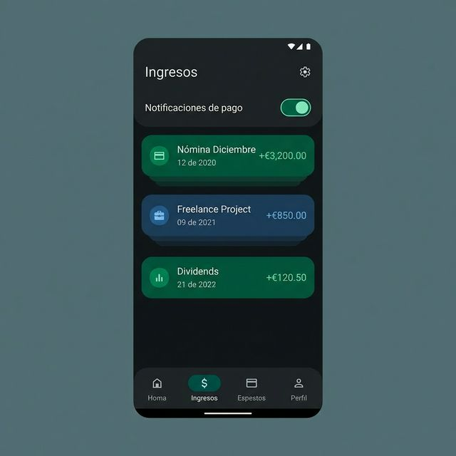
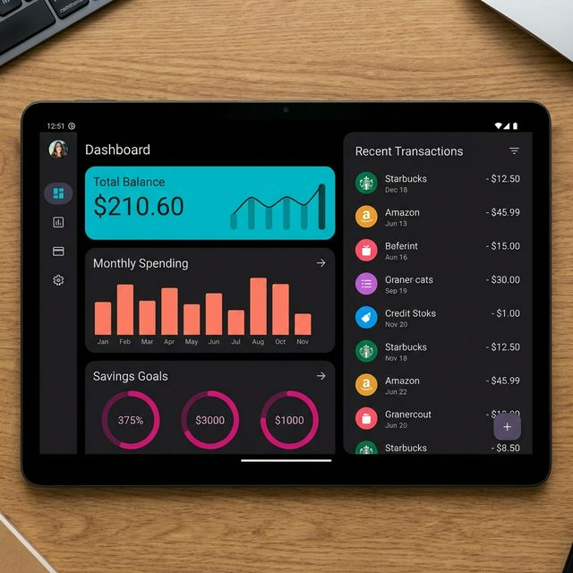

# MyLocalBank

## Descripción

**MyLocalBank** es una aplicación de gestión financiera personal para Android diseñada para ofrecer un control total sobre tus gastos e ingresos de manera rápida, sencilla y privada.

La aplicación se centra en la simplicidad y la privacidad del usuario, funcionando completamente de forma local en tu dispositivo sin necesidad de conexión a internet ni registro en servicios externos.

### Vistas de la Aplicación

*Vista principal (Dashboard)*

*Sección de ingresos y notificaciones*

*Interfaz responsiva en tablets*

## Características Principales

* **Registro Rápido de Movimientos:** Añade gastos e ingresos fácilmente.
* **Saldo Inicial Personalizado:** Define un balance de apertura para comenzar a registrar desde un punto de partida exacto.
* **Pantallas Dinámicas y Scroll Independiente:** Listas de registros de ingresos y gastos que se desplazan fluidamente de manera independiente para una excelente experiencia de usuario.
* **Notificaciones de Día de Pago Configurables:** Activa o desactiva notificaciones personalizadas por cada fuente de ingreso.
* **Diseño Responsivo:** Interfaz adaptativa que ajusta componentes y visualizaciones para teléfonos, orientación horizontal (landscape) y tablets.
* **Categorización Personalizada:** Organiza tus finanzas mediante categorías (Comida, Transporte, Hogar, etc.) para un mejor seguimiento.
* **Balance Mensual:** Visualiza el estado actual de tus finanzas mes a mes.
* **Widgets de Pantalla de Inicio:**
  * **Widget de Balance:** Un resumen rápido de tus ingresos, gastos y saldo total directamente en tu pantalla principal.
  * **Widget de Gasto Rápido:** Acceso directo para registrar nuevos gastos al instante sin abrir la aplicación completa.
* **Privacidad Total y Alto Rendimiento:** Todos los datos se almacenan localmente utilizando Room Database, el cual está optimizado con índices de búsqueda para acceso inmediato.

## Tecnologías Utilizadas

* **Lenguaje:** Kotlin
* **UI:** Android XML Layouts, Material Design 3
* **Almacenamiento Local:** Room Persistence Library
* **Arquitectura:** MVVM (Model-View-ViewModel)

## Instalación

1. Clona este repositorio.
2. Abre el proyecto en Android Studio (Ladybug o superior recomendado).
3. Sincroniza el proyecto con los archivos Gradle.
4. Ejecuta la aplicación en un emulador o dispositivo físico con Android 12 (API 31) o superior.

## Contribución

Las contribuciones son bienvenidas. Por favor, abre un "Issue" para discutir los cambios que te gustaría realizar antes de enviar un "Pull Request".

---
Desarrollado con ❤️ para el control de tus finanzas personales.
